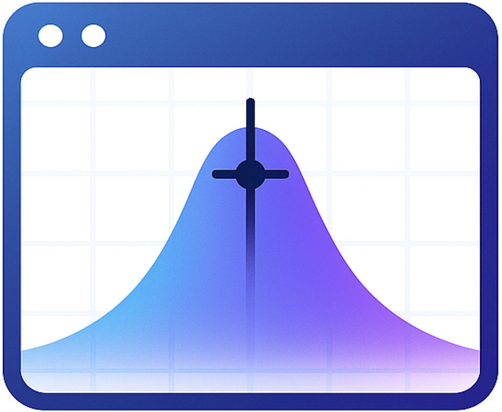
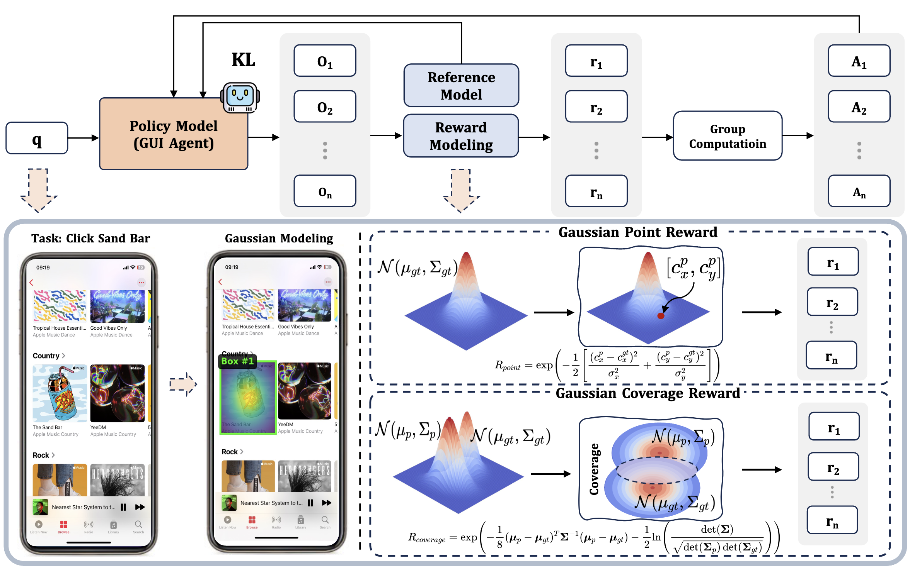
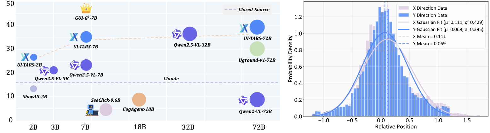

<h1 align="center">
  
  GUI-G²: Gaussian Reward Modeling for GUI Grounding
</h1>

<div align="center">

<p><em>A Gaussian dense reward framework for GUI grounding training</em></p>

[](https://arxiv.org/abs/TBA)
[](https://zju-real.github.io/GUI-G2)
[](https://github.com/zju-real/GUI-G2)

</div>

---

<div align="center">
  
  <p><em>GUI-G²: Gaussian rewards guide precise and robust GUI grounding.</em></p>
</div>

---

# 🎉 News

[2025-7-22] **We relese our paper: GUI-G²: Gaussian Reward Modeling for GUI Grounding. We plan to open-source our model GUI-G²-7B around August.**

---

# Overview

* [Motivation](#motivation)
* ✨ [Highlights](#highlights)
* 🛠 [Installation](#installation)
* 🚀 [Quick Start](#quick-start)
* [Evaluation](#evaluation)
* [Reward Customization](#reward-customization)
* 📄 [Citation](#citation)

---

# Motivation
<div align="center">
  <table width="100%">
    <tr>
      <td width="100%" align="center" valign="top">
        
        <p><em>AITW: Human GUI clicks follow Gaussian-like spatial distributions centered on targets.</em></p>
      </td>
    </tr>
  </table>
</div>

Recent studies on human interaction behavior—especially from the AITW dataset—demonstrate that GUI clicks are not random but instead form natural **Gaussian-like distributions** around the intended targets.

Motivated by this, GUI-G² adopts a **gaussian reward framework** that reflects these real-world behaviors by:

- Rewarding proximity to target centers (Gaussian Point Reward),
- Encouraging spatial region alignment (Gaussian Coverage Reward),
- Dynamically adjusting precision with element size (Adaptive Variance).
---

# ✨ Highlights

* 💡 **Gaussian Point & Coverage Rewards**: Encourage accurate, spatially-aligned clicks.
* 📏 **Adaptive Variance Mechanism**: Adjusts reward granularity based on element scale.
* 🌍 **Dense Learning Signals**: Smooth gradients outperform binary RL rewards in early-stage learning.
* 📊 **State-of-the-art Performance** on ScreenSpot, ScreenSpot-v2, and ScreenSpot-Pro datasets.

---

# 🛠 Installation

```bash
conda create -n gui-g2 python=3.10
conda activate gui-g2
bash setup.sh
````

If needed, manually install the dependencies:

```bash
pip install transformers==4.49.0
pip install deepspeed==0.15.4
pip install filelock
```

---

# 🚀 Quick Start

Train GUI-G² on your own data:

```bash
cd GUI-G2
bash run_grpo_gaussian.sh
```

You must configure:

* `DATA_PATH`: Path to your dataset YAML config
* `CKPT_PATH`: Model checkpoint path (e.g., Qwen2.5-VL)
* `image_root`: Folder containing your screenshots
* `LOG_DIR`, `SAVE_PATH`: Output folders

Training data should follow the JSONL format demonstrated in:

```
GUI-G2/src/gui_g2/data_jsonl/example_training_json.json
```

---

# Evaluation

Checkpoints will be released soon. Please stay tuned.
If you want to evaluate your model on ScreenSpot, please refer to [ScreenSpot-Pro](https://github.com/likaixin2000/ScreenSpot-Pro-GUI-Grounding).

### 📊 Results on ScreenSpot-v2

| **Model**            | **Mobile Text** | **Mobile Icon** | **Desktop Text** | **Desktop Icon** | **Web Text** | **Web Icon** | **Avg.** |
| -------------------- | --------------- | --------------- | ---------------- | ---------------- | ------------ | ------------ | -------- |
| GPT-4o               | 26.6            | 24.2            | 24.2             | 19.3             | 12.8         | 11.8         | 20.1     |
| Qwen2.5-VL-3B        | 93.4            | 73.5            | 88.1             | 58.6             | 88.0         | 71.4         | 80.9     |
| Qwen2.5-VL-7B        | 97.6            | 87.2            | 90.2             | 74.2             | 93.2         | 81.3         | 88.8     |
| SeeClick-9.6B        | 78.4            | 50.7            | 70.1             | 29.3             | 55.2         | 32.5         | 55.1     |
| UGround-7B           | 75.1            | 84.5            | 85.1             | 61.4             | 84.6         | 71.9         | 76.3     |
| OS-Atlas-7B          | 95.2            | 75.8            | 90.7             | 63.6             | 90.6         | 77.3         | 84.1     |
| UI-TARS-2B           | 95.2            | 79.1            | 90.7             | 68.6             | 87.2         | 78.3         | 84.7     |
| UI-TARS-7B           | 96.9            | 89.1            | 95.4             | 85.0             | 93.6         | 85.2         | 91.6     |
| UI-TARS-72B          | 94.8            | 86.3            | 91.2             | 87.9             | 91.5         | 87.7         | 90.3     |
| JEDI-7B              | 96.9            | 87.2            | 95.9             | 87.9             | 94.4         | 84.2         | 91.7     |
| GUI-Actor-7B         | 97.6            | 88.2            | 96.9             | 85.7             | 93.2         | 86.7         | 92.1     |
| UI-R1-3B             | 96.2            | 84.3            | 92.3             | 63.6             | 89.2         | 75.4         | 85.4     |
| UI-R1-E-3B           | 98.2            | 83.9            | 94.8             | 75.0             | 93.2         | 83.7         | 89.5     |
| SE-GUI-7B            | -               | -               | -                | -                | -            | -            | 90.3     |
| LPO                  | 97.9            | 82.9            | 95.9             | 86.4             | 95.6         | 84.2         | 90.5     |
| **GUI-G²-7B (Ours)** | **98.3**        | **91.9**        | **95.4**         | **89.3**         | **94.0**     | **87.7**     | **93.3** |

---

# Reward Customization

To implement your own reward, modify:

```
src/open_r1/gaussian_grpo.py
```

Key components:

* `Gaussian Point Reward`
* `Gaussian Coverage Reward`
* `Adaptive Variance Mechanism`

---

# 📄 Citation

If you use GUI-G², please cite our work:

```bibtex
update soon...
```
